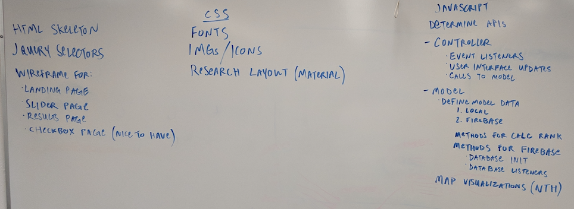
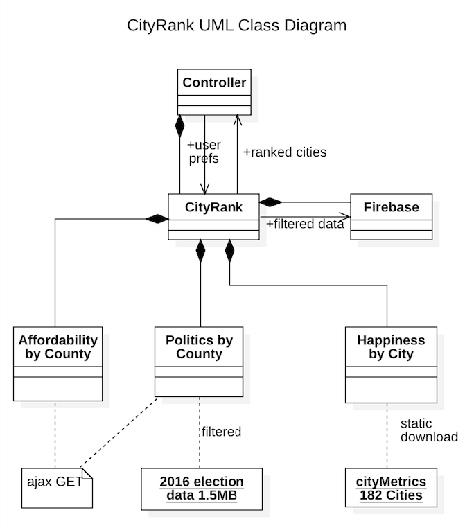
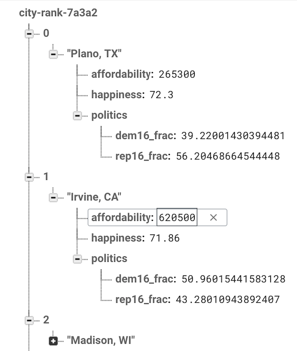
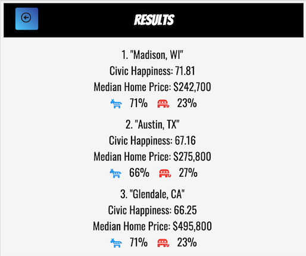

# CityRank

Rank livable cities based upon user preferences along 3 dimensions.

# Value Add Proposal

Simplify your next big move with big data and a clean user interface for specifying preferences for affordability, political affiliation, and overall civic happiness.

Indentify cities that align with your personal beliefs and priorities while putting your stereotypes aside.

# Tech Stack

* Frontend: Bootstrap, jquery, ajax.
* Backend: Firebase
* Pattern: MVC

# Roles

* Jake Stevens - Application concept and fullstack developer.
* Tue Quach - Frontend design
* Jackson Henry - Algorithm design
* Glenn Streiff - Model design, Integration

# MVP

* Phase One - select APIs and implement simple user interface.
* Phase Two - get data flowing, filtered, and uploaded to firebase.
* Phase Three - refine user interface while evolving the controller.
* Phase Four - integrate MVC
* Phase Five - refine, test, present.

# Team Management

[Project Board](https://github.com/team-jjtg/CityRank/projects/1)

# Demo

Our application is hosted [here](https://team-jjtg.github.io/CityRank/).

# Designer's Log

It's April 15, 2019 and we've formed into teams of four. Since we only have 2 weeks to knock this out, we're mindful of keeping the scope reasonable.

Jackson suggests an application to select a University. Jake suggests we generalize to selecting a city in which to live. We think about various attributes an come up with an interface that features sliders:

Jake got us thinking about deliverables:

and cleaned up our design sketches into wireframes:

Eventually we scrub on weather since that is actually more nebulous than other metrics.

The hunt is on for endpoints for the other data.

Jake finds:

- [jooble](https://us.jooble.org/) for jobs
- [api.census.gov](https://api.census.gov/data/2017/acs/acs5/profile?get=DP04_0089E,NAME&for=county:*) for median home price by county, an expedient proxy for affordability
- [civic happiness](https://wallethub.com/edu/happiest-places-to-live/32619)

I find:

- political data at [opendatasoft.com](https://public.opendatasoft.com/api/records/1.0/search/?dataset=usa-2016-presidential-election-by-county&facet=county&rows=3)
- city-to-county mapper at [statsamerica.org](http://statsamerica.org/CityCountyFinder/Default.aspx)

This data get cooked down into several objects:

The political data set is huge, over 100 MB encompassing all 3143 counties:

I elect to post-process that down to 1.5 MB and check-it in.

The civic-happiness data is similarly rendered down to 182 lines of array data. Out of practicality, we'll limit our search to this list. The trick now becomes back-filling the other parameters of interest to match these cities (i.e., political affiliation, affordability, and job outlook). To do this, we'll need a county-to-city lookup since
our political data and affordability data are organized by county.

Soon data starts to flow with ajax calls to gather median home price (and county data):

Our goal is to crunch down all this bulky data and upload to firebase where it can be used as our own custom-endpoint for the app:

Along the way, we encounter bugs like this where one dataset uses a slightly different name for a county (i.e, 'Lucie County' versus 'St. Lucie County'). We either augment out methods to normalize this or expediently nix that city in the heat of battle toward MVP.

The other interesting bug is that firebase does not like your keys to have '.' dots in them:

After Jake handed me some example code for interfacing with the jobs and affordability endpoints, I focussed on the model and Jake shifted to working with Tue on the front-end.

Initially I thought it would be cool to explore Material Lite UI, and that sent Tue on a steep learning curve that our kind TAs suggested we abandon for something simpler like Materialize or, as Tue found, Bootstrap's Material Design.

Jackson worked on the algorithm for ranking our cities, by computing the 'distance' between a user's preferences and the attributes of each city. We ultimately went with a vector difference calculation and we normalized our input axes to a scale of 0 to 100 so each
attribute would be weighted equally and we could get meaninful results.

The integration between the frontend and backend went pretty quickly, about two hours of effort. Then it was all about smoothing out the rough edges and deciding we didn't have runway to complete the job-lookup, though we left it grayed-out in the design to suggest our direction.

At this stage, we have something upon which we could build:

Perhaps as a second project, we could add more interesting visualizations:

